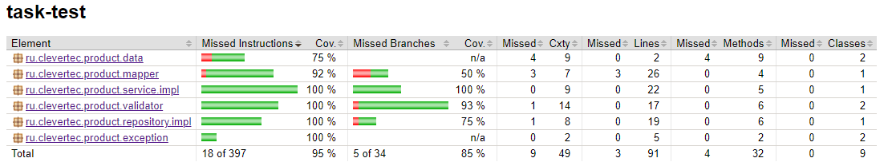

# Задание:

1. Выкачиваем репозиторий CoursesJava/task-test (github.com)
2. Проект должен быть совместим с java 17
3. Придерживать GitFlow master -> develop -> feature/{class}
4. Покрыть unit tests ВСЕ методы классов:
    1) [ProductServiceImpl.java](src%2Fmain%2Fjava%2Fru%2Fclevertec%2Fproduct%2Fservice%2Fimpl%2FProductServiceImpl.java)
    2) [InMemoryProductRepository.java](src%2Fmain%2Fjava%2Fru%2Fclevertec%2Fproduct%2Frepository%2Fimpl%2FInMemoryProductRepository.java)
    3) [ProductMapperImpl.java](src%2Fmain%2Fjava%2Fru%2Fclevertec%2Fproduct%2Fmapper%2Fimpl%2FProductMapperImpl.java)
5. В тестах использовать Mock’s, ArgumentCaptor, Parametrised Tests
6. Каждый протестированный class = 1 MR (PR), т.е. получится 3 MR
   (PR) в develop
7. Получившиеся 3 (+1 из доп. задания) MR’a (PR) вмёрживаете в develop и делаете общий PR в master, который указываете в
   форме (пункт 8)
8. Заполнить и отправить [форму](https://forms.gle/rSLSUX91JCb9KUXu6)

## Дополнительно

1. Создать ветку develop -> feature/impl
2. Реализовать логику всего функционала
3. Использовать mapstruct
4. Использовать ТОЛЬКО стримы
5. Сделать PR в develop (при выполнении дополнительного задания
   общая сумма MR’ов (PR) будет = 4)

## Смотрите javaDoc в интерфейсах и классах для создания тестов:

- [Product.java](src%2Fmain%2Fjava%2Fru%2Fclevertec%2Fproduct%2Fentity%2FProduct.java) - Продукт с идентификатором и
  датой создания
- [ProductDto.java](src%2Fmain%2Fjava%2Fru%2Fclevertec%2Fproduct%2Fdata%2FProductDto.java) - Минимальный набор данных
  для создания и модификации продукта
- [InfoProductDto.java](src%2Fmain%2Fjava%2Fru%2Fclevertec%2Fproduct%2Fdata%2FInfoProductDto.java) - Информация о
  продукте включающая идентификатор
- [ProductService.java](src%2Fmain%2Fjava%2Fru%2Fclevertec%2Fproduct%2Fservice%2FProductService.java) - Интерфейс для
  работы с продуктами
- [ProductServiceImpl.java](src%2Fmain%2Fjava%2Fru%2Fclevertec%2Fproduct%2Fservice%2Fimpl%2FProductServiceImpl.java) -
  Реализация [ProductService.java](src%2Fmain%2Fjava%2Fru%2Fclevertec%2Fproduct%2Fservice%2FProductService.java)
- [ProductRepository.java](src%2Fmain%2Fjava%2Fru%2Fclevertec%2Fproduct%2Frepository%2FProductRepository.java) -
  Интерфейс для хранения продуктов
- [InMemoryProductRepository.java](src%2Fmain%2Fjava%2Fru%2Fclevertec%2Fproduct%2Frepository%2Fimpl%2FInMemoryProductRepository.java) -
  Реализация [ProductRepository.java](src%2Fmain%2Fjava%2Fru%2Fclevertec%2Fproduct%2Frepository%2FProductRepository.java)
- [ProductMapper.java](src%2Fmain%2Fjava%2Fru%2Fclevertec%2Fproduct%2Fmapper%2FProductMapper.java) - Интерфейс для
  маппинга
- [ProductMapperImpl.java](src%2Fmain%2Fjava%2Fru%2Fclevertec%2Fproduct%2Fmapper%2Fimpl%2FProductMapperImpl.java) -
  Реализация [ProductMapper.java](src%2Fmain%2Fjava%2Fru%2Fclevertec%2Fproduct%2Fmapper%2FProductMapper.java)
- [ProductNotFoundException.java](src%2Fmain%2Fjava%2Fru%2Fclevertec%2Fproduct%2Fexception%2FProductNotFoundException.java) -
  Исключение выпадающее только на сервисном слое

## Ход выполнения задания:
1. Выкачан репозиторий CoursesJava/task-test (github.com)
2. Проект совместим с java 17
3. Придерживался GitFlow master -> develop -> feature/{class}
4. Покрыл тестами все методы классов по технике TDD:
    1) [ProductServiceImpl.java]
    2) [InMemoryProductRepository.java] - на класс репозитория написаны интеграционные тесты
    3) [ProductMapperImpl.java]
5. В тестах использовал Mock’s, ArgumentCaptor, Parametrised Tests
6. Сделал 3 PR в develop протестированных классов
7. Создал ветку develop -> feature/impl
8. Реализовал логику функционала
9. Использовал mapstruct
10. Использовал стримы где смог
11. Сделал ProductDtoValidator и тесты на него
12. Сделал PR в develop (общая сумма PR = 4)
13. Сделал PR из develop в master
## Отчет о покрытии тестами:

